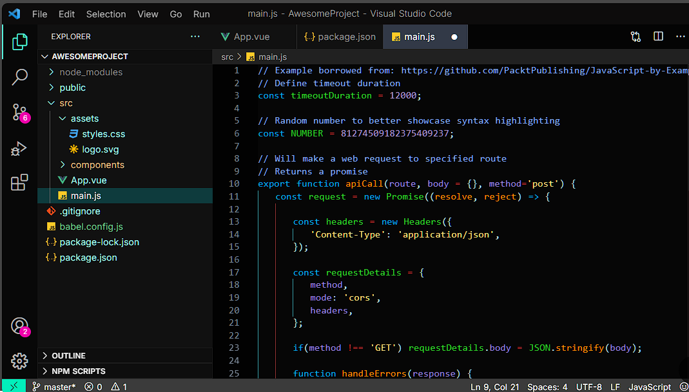

# DragonGlitch
Dragon Glitch is a dark theme with vibrant accents, designed to be visually appealing while providing a comfortable coding experience.

Key features:

Dark background: Reduces eye strain and provides a sleek, modern look.
Neon-bright accents: Colors like electric blue, vibrant green, and fiery red are used strategically to highlight code elements and make them stand out. This adds visual interest and aids in code comprehension.
Glowing glitch effect: Subtle glitch-style animations or distortions might be incorporated, adding a dynamic and futuristic feel. This could manifest in the cursor, highlighting, or even within the code itself.
Clear, readable fonts: A monospace font with good legibility is crucial for any coding theme. Dragon Glitch likely prioritizes fonts designed for coding, ensuring characters are easily distinguishable.
Overall impression:

Dragon Glitch aims to create an immersive and engaging coding environment. The combination of dark, calming backgrounds with bright, eye-catching accents is both stylish and functional. The potential addition of glitch effects further enhances the theme's unique identity, appealing to those who like a touch of the futuristic and unconventional.

